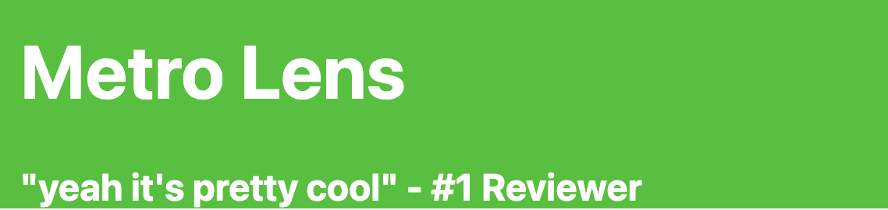
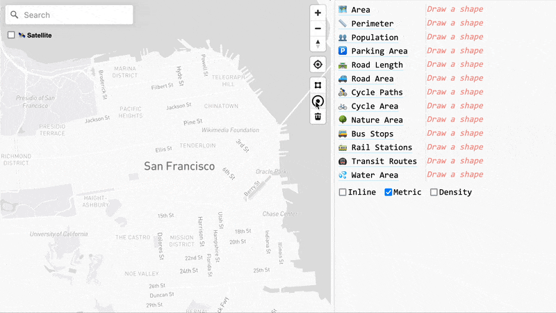
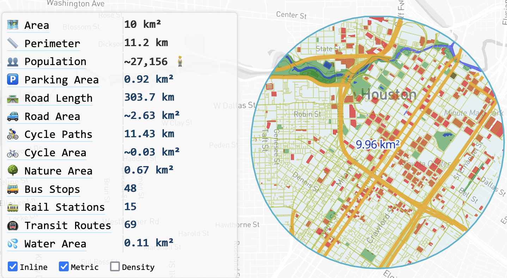
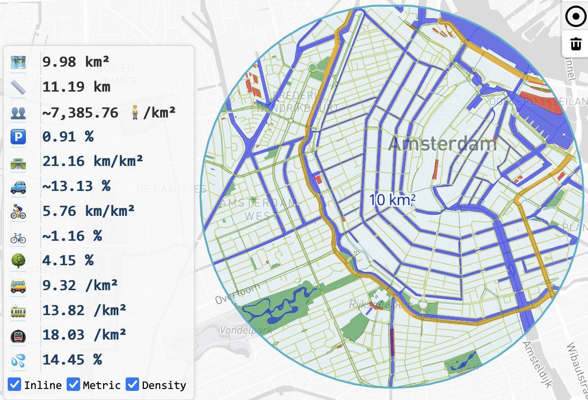
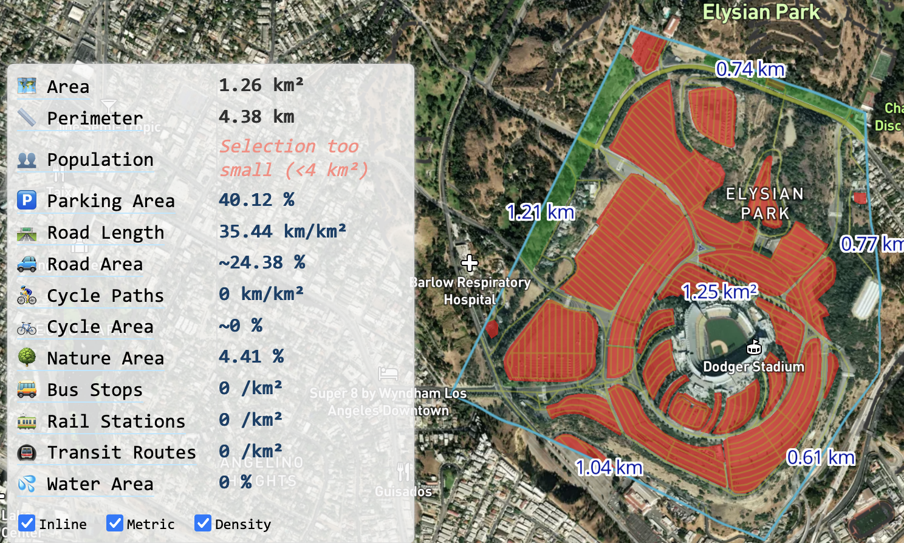
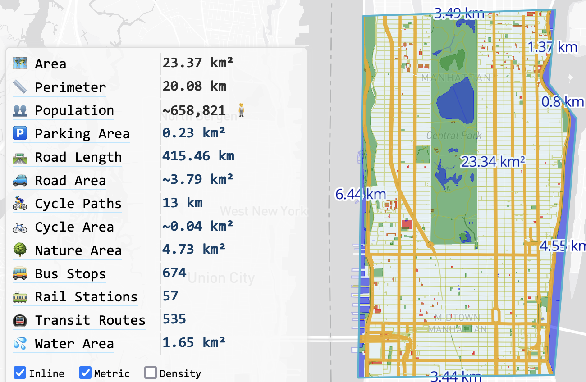

# [Metro Lens](https://metro.pelmers.com)

### Interactive maps of urban land use and mobility

### Description

[Metro Lens](https://metro.pelmers.com) is a web app built to answer some of the questions I have most often about urban areas.
 - How large is the area?
 - How many people live here?
 - How many cycling paths are there?
 - How much car parking?
 - How many bus routes? Train stations? Parks and recreation areas?

This app specifically answers all these questions on any arbitrary provided shape, scratching
the urbanism investigation itch, a la [CityNerd](https://www.youtube.com/c/citynerd).
See the examples below and compare your favorite city, or shame your most detested!

Try it here: [metro.pelmers.com](https://metro.pelmers.com).
For more details: [My Blog post](https://pelmers.com/metro-something-something/).

### Examples

*10km radius around Houston*

*10km radius around Amsterdam, density stats*

*Dodger Stadium, LA*

*Manhattan, NYC*

**What will you discover?**

### Usage

The app presents a map, initially centered on a randomly selected large city.
Click either the polygon or circle button to draw a shape on the button.
Then see relevant areas highlighted on the map and the statistics table populated.
You can customize various display options, such as changing between satellite and map views, or metric and imperial measurements.

Data sources:

- [WorldPop](https://www.worldpop.org)
- [OpenStreetMap](https://www.openstreetmap.org)

### Future work

- See [Roadmap.md](./Roadmap.md)
